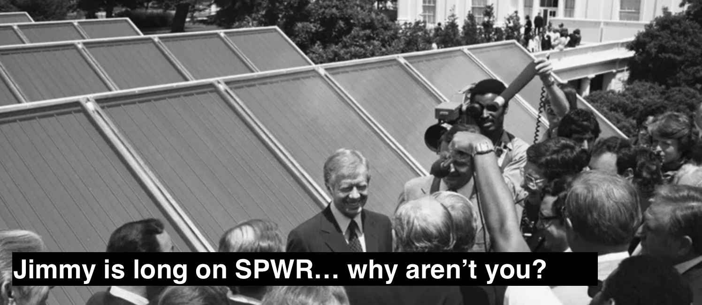

# Wall Street vs. Main Street

### GME and others have heavy outstanding short positions. 
- AMC = AMC Entertainment Holdings Inc
- SPCE = Virgin Galactic Holdings Inc
- FUBO = Fubotv Inc
- BBBY = Bed Bath & Beyond Inc.
- PUBM = PubMatic Inc
- FIZZ = National Beverage Corp.
- LGND = Ligand Pharmaceuticals Inc.
- MAC = Macerich Co
- SPWR = SunPower Corporation

[Jimmy Carter's Solar Panels](https://www.treehugger.com/whatever-happened-jimmy-carters-solar-panels-sequel-4858031)

## Short Interest Change vs. Short Interest 

## Short Interest vs. Public Availability

### Definitions

